# NEXUS — AI Operating System for Schools

> **🚀 [Click here for the Live Deployment](https://nexus-school-os.vercel.app)**
> **📄 [Click here for the Google Doc Documentation](https://docs.google.com/document/d/1FE2-6mtnKE6ZKbu6pr_gY_7dSU4V2SzQ/edit?usp=drivesdk&ouid=100993605915840593739&rtpof=true&sd=true)**

[](https://github.com/sanikommu-bhanu/nexus-school-os/actions/workflows/ci.yml)

An AI-powered school operating system that replaces manual data entry, paper
records and siloed scheduling with one intelligent platform for admins,
teachers, students and parents.

Real source, not a mockup — run it locally against your own free-tier Firebase
project. Every push runs typecheck, lint, a production build, three pure test
suites, and the **Firestore security-rules suite against a live emulator**, so
the rules are proven to reject the attacks they claim to reject rather than
merely looking strict.

> [!IMPORTANT]
> ### 🏆 Key Technical Innovations for Competition Judges
> 1. **Zero-Cost Production Architecture**: Built entirely on free-tier services (Firebase Auth/Firestore + Cloudinary + Gemini) with zero cloud bill.
> 2. **Strict Service Layer Boundaries**: Screens never touch Firestore directly—all I/O passes through service wrappers enforcing single-writer collection discipline.
> 3. **Grounded AI Security**: Gemini operates strictly via server-side proxies (`/api/ai/ask`) over client-scoped Firestore facts, preventing query injection and hallucinations.
> 4. **Live-Emulator Security Suite**: Firestore security rules are validated against a live local emulator in CI on every commit.

---

## Live Demo

**Live application:** <https://nexus-school-os.vercel.app>
**Repository:** <https://github.com/sanikommu-bhanu/nexus-school-os>

Sign in with any of the four accounts below to explore NEXUS from that role's
point of view. No setup, no local install.

> [!NOTE]
> **Production Application vs. Demo Setup:** NEXUS is a **fully functional, real-world school operating system**—not a static prototype or sandbox mockup. Every single screen, AI query, attendance capture, and fee payment operates against live backend database services. The pre-seeded demo environment below was specifically designed so judges and evaluators can instantly test the rich, end-to-end multi-role workflows without needing to build a school from scratch.

### Demo credentials

| Role | Email | Password |
|---|---|---|
| Administrator | `demo.admin@nexus-demo.school` | `NexusAdmin!2026Demo` |
| Teacher | `demo.teacher@nexus-demo.school` | `NexusTeacher!2026Demo` |
| Student | `demo.student@nexus-demo.school` | `NexusStudent!2026Demo` |
| Parent | `demo.parent@nexus-demo.school` | `NexusParent!2026Demo` |

These are **fictional accounts created specifically for evaluating NEXUS**.
They belong to a demonstration school — *NEXUS International School* — whose
teachers, students, parents and families are invented. No real person's data
appears anywhere in the demo, and these credentials grant access to nothing
beyond that demo school.

The demo data is **real records, not mocked numbers**. Attendance percentages,
submission tallies, class sizes and fee balances are all computed by the same
services and queries the production app uses, from actual Firestore documents —
including a month of deliberately uneven attendance, so the analytics and the
AI have something true to find rather than a flat 100%.

### What each role demonstrates

**Administrator** — the whole school ecosystem: teachers, classes, students,
attendance trends, assignments, the timetable, policy documents, fee records,
workload analysis and school-wide AI insights.

**Teacher** — their own classes only: the student roster, marking and editing
attendance, creating assignments and grading submissions, their teaching
timetable, and teacher-scoped AI assistance.

**Student** — their own record only: enrolled classes, personal attendance,
assignments due and handed in, class timetable, shared documents, and
student-scoped AI help.

**Parent** — their linked children only: each child's attendance, assignment
status, timetable, announcements and fee position, plus parent-scoped AI.

> **Role isolation is enforced by Firestore security rules, not by the UI.**
> A teacher cannot read another teacher's class, a student cannot read another
> student's record, a parent sees only linked children, and no school can read
> another school's data. NEXUS AI inherits exactly these boundaries — it answers
> from permission-scoped tool calls, so it can never surface data the signed-in
> user could not already open themselves. Signing in as each role in turn is the
> quickest way to see that hold.

### Prefer to see the real onboarding flow?

The demo accounts above skip straight to populated dashboards. To watch the
actual product flow instead, sign up as a new admin and follow
create school → share the school code/QR → teacher joins → creates a class →
student joins by class code/QR → parent connects to their child. That path is
unchanged by the demo data and is described in
[join and membership flows](#join-and-membership-flows).

---

## System diagrams

Six system-level diagrams are below. Four more detailed walkthroughs live
further down, next to the code they describe:
[data model](#the-data-model) ·
[join and membership flows](#join-and-membership-flows) ·
[auth and onboarding routing](#auth-and-onboarding-routing) ·
[the AI request path](#the-ai-request-path).

### 1. System architecture

Four layers, one rule: screens never touch Firestore directly, and the domain
logic never touches the network.

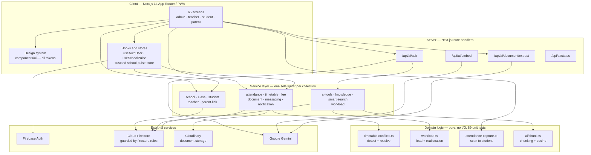

**Why file storage is Cloudinary, not Firebase Storage:** Storage requires the
paid Blaze plan. Auth and Firestore stay on the free tier, so the whole system
runs at zero cost.

---

### 2. AI document processing and the RAG knowledge base

How a physical form becomes answerable knowledge. The API key never reaches
the browser — every model call is proxied through a server route.
(The tool-calling side of a question is detailed in
[the AI request path](#the-ai-request-path).)

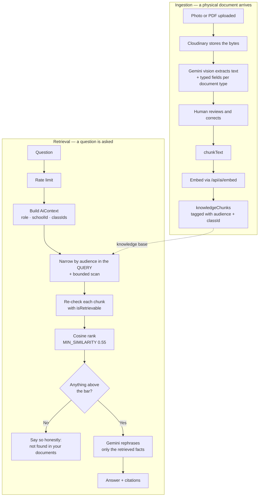

**Two things worth noting.** Permission is enforced *twice* — narrowed in the
query for cost, then re-checked in memory for security, because Firestore
cannot verify class membership. And when nothing clears the relevance bar the
system returns **nothing** rather than forcing a weak match, so it can say "I
don't know" instead of inventing an answer.

---

### 3. Timetable — conflict detection and resolution

Detection alone tells an admin "no". Resolution answers the question they
actually have next: *then where can it go?*

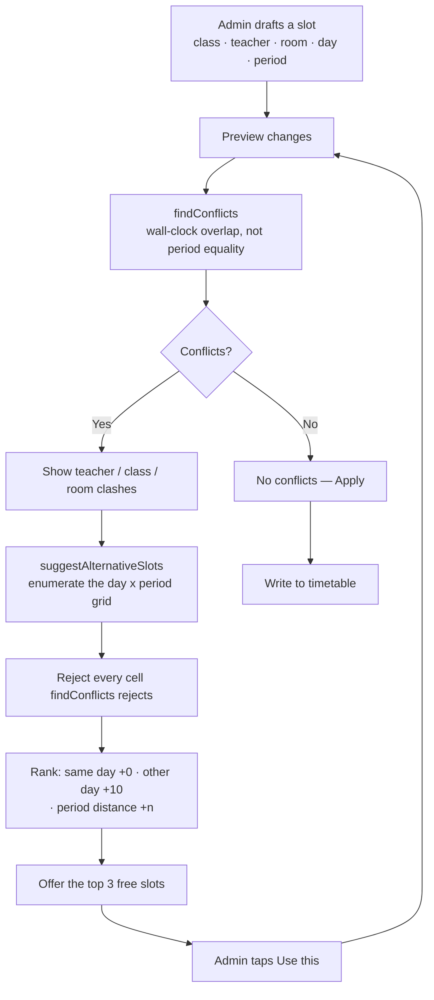

The loop is deliberate: a suggestion is re-verified by the **same detector**
the admin just used, so the system can never recommend something impossible.

---

### 4. Predictive resource allocation

Staffing recommendations derived from the school's own timetable — no model,
so every suggestion can be explained and justified.

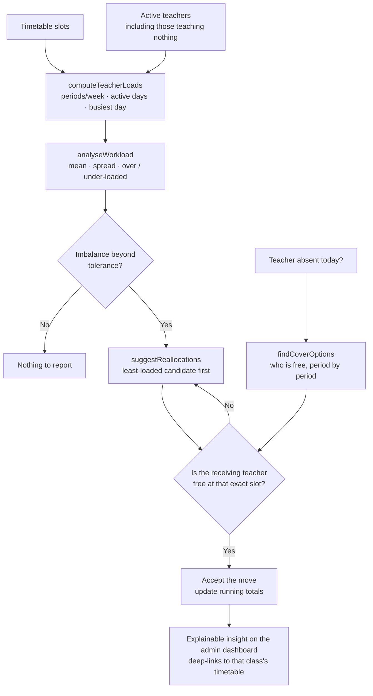

Every move is checked against the **same conflict detector** used above, so a
recommendation is never impossible to act on.

---

### 5. Automated attendance capture

RFID/NFC, camera and keyboard converge on one code path — there is no second
attendance pipeline to keep in sync.

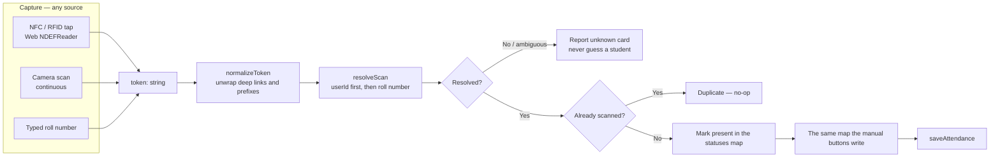

If no NDEF payload is present the tag's **hardware serial** is used, so a
school keeps its existing RFID cards instead of reissuing every one.

---

### 6. Reactive dashboard state

The admin dashboard is a live command center, not a snapshot. Mark attendance
on a phone and the dashboard updates on a laptop without a refresh.

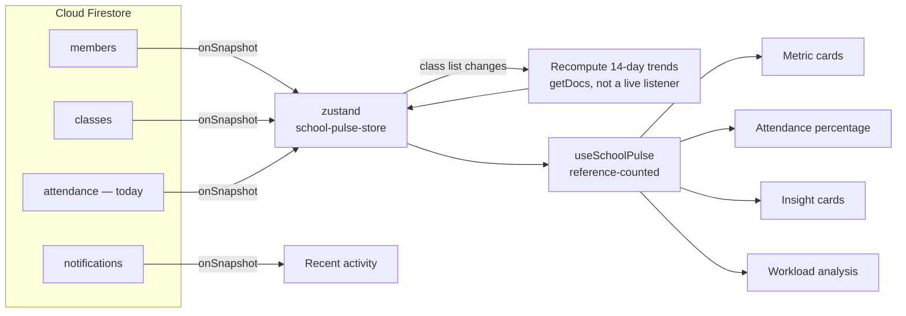

**A deliberate cost decision:** members, classes and *today's* attendance are
live, because those change during a school day. The 14-day trend windows are
recomputed on change instead — a fortnight of history does not move
second-to-second, and N live listeners over a 14-day range would be real money
for no observable benefit.

---

### 7. Verification pipeline

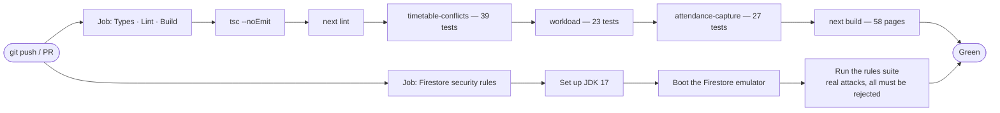

The rules suite needs a JVM, which a plain Windows dev box does not have — so
CI is where those tests actually execute on every commit. Running them locally
prints a clear preflight message with the one-line install per platform.

---

## Run it

```bash
npm install
cp .env.example .env.local   # fill in your Firebase project config
npm run dev
```

Without a `.env.local`, the app still renders (Splash → Onboarding → Role → Auth) but auth calls will show a friendly "Firebase isn't configured yet" message instead of failing silently — the whole app was built to degrade gracefully rather than crash when config is missing.

## What's built so far

- **Design system**: `GlassSurface`, `Button`, `Input`, `Avatar`, `Badge`, `PageHeader`, `ProgressDots` — all in `components/ui`, all deriving color/spacing/radius from `tailwind.config.ts`. Nothing in the screens hardcodes a color; it's all tokens, so the whole app restyles from one file.
- **Screens**: Splash (`app/page.tsx`), Onboarding x3 (`app/onboarding`), Role Selection (`app/role`), Auth — Google + Email, login and create-account, with real validation, password rules, show/hide, and loading/success/error states (`app/auth`).
- **Data layer**: `types/index.ts` mirrors the Firestore schema exactly. `lib/firebase.ts` initializes Auth/Firestore/Storage from env vars only. `services/user-service.ts` is the *only* place that touches `users/{uid}` — screens call the service, never Firestore directly. This is what makes "one source of truth" a real constraint in the code, not just a design doc.
- **Real auth**: Google Sign-In via `signInWithPopup` and email/password via Firebase Auth are actually wired up (not stubbed), including new-vs-existing-user routing and friendly error mapping (`friendlyAuthError`).

## Phase 2 — added on top of Phase 1

- **Services**: `school-service.ts`, `class-service.ts`, `teacher-service.ts`, `student-service.ts`, `parent-link-service.ts` — each the sole writer of its collection, same pattern as Phase 1's `user-service.ts`. See `SCHEMA.md` for the full collection reference and why membership is modeled as subcollections (idempotent joins + cheap security-rule checks).
- **Shared components**: `QRDisplay` (generate + copy/share/download), `QRScanner` (camera scan with a manual-entry fallback tab), `States.tsx` (`LoadingState`/`ErrorState`/`EmptyState`/`SuccessState`), `ConnectionSuccess` (the one reusable "you're connected" moment used by all four roles).
- **Auth/role guarding**: `hooks/useAuthUser.ts` + `components/AuthGuard.tsx` enforce — unauthenticated → `/role`, wrong role for a role-prefixed route → sent to their own home instead, onboarding incomplete → `/setup/[role]`.
- **Full setup flows, all real and wired to Firestore**:
  - Admin: Create School → School Created (QR/code share)
  - Teacher: Join School (scan/code) → Profile Setup → Create Class → Class Created (QR/code share)
  - Student: Join Class (scan/code → confirm before joining, duplicate-safe) → Profile Setup → Connect Parent (shares invite QR)
  - Parent: Profile Setup → Connect to Child (scan/code → confirm identity before linking) → Connection Success
- **Firestore**: `firestore.rules` (real role/membership/ownership checks, no open rules) and `firestore.indexes.json` (the composite indexes the code-lookup queries need).
- **Dashboard stubs**: `/admin`, `/teacher`, `/student`, `/parent` are guarded placeholder screens so the whole flow is navigable end to end — the real dashboards are Phase 3.

### The data model

The collection tree below is `SCHEMA.md` drawn out, annotated with the service that is the sole writer of each collection. Exact document-id conventions (e.g. attendance's deterministic `classId_studentId_date`) stay in `SCHEMA.md`.

```mermaid
flowchart TD
    subgraph TOP["Top-level collections"]
        USERS["users<br/>writer: user-service"]
        TEACHERS["teachers<br/>writer: teacher-service"]
        STUDENTS["students<br/>writer: student-service<br/>holds parentLinkCode"]
        PARENTS["parents<br/>writer: parent-link-service"]
        LINKS["parentStudentLinks<br/>writer: parent-link-service"]
    end

    SCHOOLS["schools<br/>writer: school-service<br/>holds public join code"]
    SMEM["members<br/>writer: school-service<br/>gates isSchoolMember in rules"]
    CLASSES["classes<br/>writer: class-service<br/>holds public class code"]
    CMEM["members<br/>writer: class-service<br/>gates isClassMember in rules"]

    SCHOOLS --> SMEM
    SCHOOLS --> CLASSES
    CLASSES --> CMEM

    subgraph P3["Phase 3 collections — all nested under a school"]
        ATT["attendance<br/>writer: attendance-service"]
        ASG["assignments<br/>writer: assignment-service"]
        SUB["submissions<br/>seeded by assignment-service"]
        TT["timetable<br/>writer: timetable-service"]
        DOC["documents<br/>writer: document-service"]
        ANN["announcements<br/>writer: announcement-service"]
        NOT["notifications<br/>written by other services, never by a screen"]
        CONV["conversations<br/>writer: messaging-service"]
        MSG["messages<br/>writer: messaging-service"]
        FSTR["feeStructures<br/>writer: fee-service, admin only"]
        FPAY["feePayments<br/>writer: fee-service, admin only"]
    end

    SCHOOLS --> ATT
    SCHOOLS --> ASG
    ASG --> SUB
    SCHOOLS --> TT
    SCHOOLS --> DOC
    SCHOOLS --> ANN
    SCHOOLS --> NOT
    SCHOOLS --> CONV
    CONV --> MSG
    SCHOOLS --> FSTR
    SCHOOLS --> FPAY

    BYTES[("Cloudinary<br/>document bytes live here")]
    DOC -.->|fileURL| BYTES

    LINKS -.->|studentId| STUDENTS
    LINKS -.->|parentId| PARENTS
    USERS -.->|schoolId| SCHOOLS
```

### Join and membership flows

Every join is code-based (QR or typed), always shows a confirm step before writing, and every membership write is idempotent — a double-scanned QR returns `alreadyMember` / `alreadyJoined` / `alreadyLinked` instead of creating a second row.

```mermaid
flowchart TD
    subgraph ADMIN["Admin — create school"]
        A1["Create School form"] --> A2["school-service.createSchool"]
        A2 --> A3["schools doc + members/uid as admin<br/>public code e.g. SCH-7F82K91"]
        A3 --> A4["School Created — QR + code share"]
    end

    subgraph TEACHER["Teacher — join school, then create a class"]
        T1["Scan QR or type school code"] --> T2["school-service.getSchoolByCode"]
        T2 --> T3{"Confirm school<br/>before joining"}
        T3 -->|Confirm| T4["addSchoolMember - reads members/uid first"]
        T4 --> T5{"already a member?"}
        T5 -->|yes| T6["return alreadyMember true<br/>no duplicate write"]
        T5 -->|no| T7["write members/uid as teacher"]
        T6 --> T8["Teacher profile setup"]
        T7 --> T8
        T8 --> T9["class-service.createClass<br/>classes doc + code e.g. NX10A-MATH-42"]
        T9 --> T10["Class Created — QR + code share"]
    end

    subgraph STUDENT["Student — join class"]
        S1["Scan class QR or type code"] --> S2["class-service.getClassByCode"]
        S2 --> S3{"Confirm your class"}
        S3 -->|Confirm and Continue| S4["Student profile setup"]
        S4 --> S5["class-service.joinClassAsStudent"]
        S5 --> S6["addSchoolMember as student — idempotent<br/>without it every school-scoped read is denied"]
        S6 --> S7{"class members/uid exists?"}
        S7 -->|yes| S8["return alreadyJoined true"]
        S7 -->|no| S9["write class members/uid<br/>then increment studentCount"]
        S9 --> S10["Connect Parent — shares invite QR"]
        S8 --> S10
    end

    subgraph PARENT["Parent — connect to child"]
        P1["Parent profile setup"] --> P2["Scan invite QR or type parentLinkCode"]
        P2 --> P3["parent-link-service.resolveParentLinkCode"]
        P3 --> P4{"Confirm child identity<br/>from the returned preview"}
        P4 -->|Confirm| P5["linkParentToStudent"]
        P5 --> P6{"link already exists<br/>for this parent and student?"}
        P6 -->|yes| P7["return alreadyLinked true"]
        P6 -->|no| P8["transaction — parentStudentLinks doc<br/>plus parents.childIds arrayUnion"]
        P8 --> P9["addSchoolMember as parent — idempotent"]
        P9 --> P10["updateUserProfile — schoolId + onboardingComplete"]
        P10 --> P11["Connection Success"]
        P7 --> P11
    end

    A4 -.->|school code| T1
    T10 -.->|class code| S1
    S10 -.->|parentLinkCode| P2
```

### Auth and onboarding routing

This traces `hooks/useAuthUser.ts` and `components/AuthGuard.tsx` as written. Two details worth reading off the diagram: an unauthenticated user is sent to **`/role`, not `/auth`** (so a sign-out that races the guard lands in one predictable place, and `/auth` always receives an explicit role), and a *failed* profile read renders a retryable error rather than redirecting — it is deliberately not treated as "signed out".

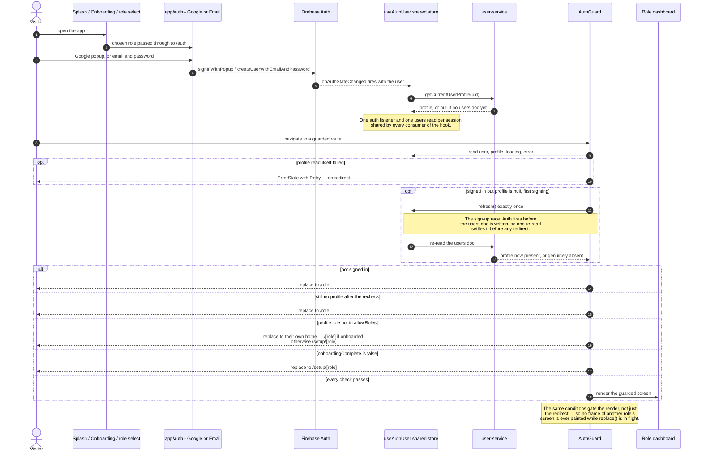

## Phase 3 — role dashboards, real-time features, and messaging

- **Role dashboards**: Admin (School Pulse metrics, NEXUS Intelligence insights, quick actions, recent activity), Teacher (today's schedule, classes, tasks), Student (today, assignments, progress), Parent (child switcher, attendance/assignments/progress) — all reading live Firestore data, zero hardcoded numbers.
- **Attendance, assignments, timetable, documents, announcements**: full workflows per role, canonical collections shared across all four experiences (mark once as a teacher, everyone with permission sees the same record).
- **Messaging** (`services/messaging-service.ts`): 1:1 conversations between Teacher↔Parent and Teacher↔Student, built on the `conversations`/`messages` subcollections already defined in `SCHEMA.md`. `getOrCreateConversation` is idempotent so "Message" buttons never create duplicate threads. Realtime via `onSnapshot`, unread state via `unreadFor` array, notification fan-out via `createNotification`. Entry points: message bell (with unread badge) on Teacher/Student/Parent home headers, "Message parent" per student on the teacher's class roster, "Message teacher" on the parent home and student class-detail screens, and a dedicated contact picker (`/teacher/messages/new`) built from the teacher's actual class rosters + `getParentsForStudent`.
- **Security**: no rule changes needed — `firestore.rules` already scoped conversation/message read/write to participants only, so messaging plugs into the existing security model.
- **AI phrasing** (`app/api/ai/ask/route.ts`, `app/api/ai/status/route.ts`): server-only routes that read `GEMINI_API_KEY` (never exposed to the client) and phrase the existing permission-scoped tool results from `services/ai-tools-service.ts` into natural sentences — the model is only ever given facts already resolved by a real Firestore query for that user's role, never asked to invent school data. Without a key configured, `askNexus()` falls back to the same deterministic templates it always used, so nothing regresses.
- **Teacher class announcements**: `getAnnouncementsForClass()` plus a composer at `/teacher/classes/[classId]/announcements`, visible to students on their class page and to parents on Updates (scoped to the selected child's class) — reuses the same `announcements` collection and rules the admin school-wide announcements already used.
- **Notification centers**: dedicated `/teacher/notifications` and `/student/notifications` screens plus a header bell with an unread badge on every role's home screen (Admin already had Recent Activity, Parent already had the Updates tab — this brings Teacher/Student to parity).

- **Fee management** (`services/fee-service.ts`): admin defines fee structures (school-wide or per-class) at `/admin/school/fees` and records real payments there — no payment gateway is faked, amounts only change when an admin logs money actually collected (matches the project's no-fake-data rule, same philosophy as attendance being "marked" not sensed). Students see their live due/paid/balance breakdown at `/student/fees`; parents see it per selected child at `/parent/fees`, with a summary card on the parent home screen.

### The AI request path

The security-relevant one. Read the boundary carefully, because it is **not** "the server does the lookups":

- The tool layer (`ai-tools-service.ts` → `ai-tool-registry.ts`) runs **in the browser** — it calls `/api/ai/ask` with a relative URL. Its Firestore queries are ordinary client SDK reads, and the thing that actually enforces authorization is `firestore.rules` server-side, backed by the in-registry `requireRole` / `requireOwnClass` / `requireOwnStudent` guards.
- The API route is server-only and exists for exactly one reason: it holds `GEMINI_API_KEY` (no `NEXT_PUBLIC_` prefix, so it never enters the client bundle). **The route never touches Firestore at all.**
- Tool selection is keyword-based inside `askNexus`. The model does not choose tools, does not supply IDs, and never sees a Firestore handle — every ID used in a query comes from an `AiContext` built from the caller's own profile.

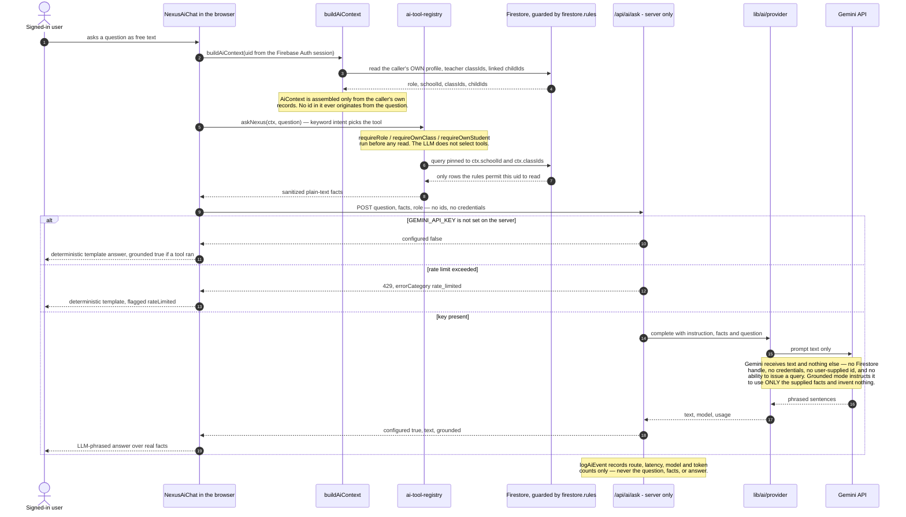

A question that matches no intent takes the same route with **no** facts attached; the route then switches to its general instruction, which forbids the model from implying it can see school records. Either way the response carries `grounded`, so the UI never has to guess whether an answer was backed by real data.

## Not built yet

1. A real payment gateway for fees (Razorpay/Stripe etc.) — `feeStructures`/`feePayments` are modeled and the admin-recorded flow is real and functional, but online self-service payment would need a merchant account and PCI-scoped handling that's out of scope for a free-tier Firebase project.

## Architecture rule this project follows

Screens never call Firestore directly. They call a function in `services/`. That's the enforcement mechanism for "if a teacher updates attendance, admin/student/parent all see it" — there's exactly one write path per collection, so there's nowhere for a second, disconnected copy of the data to come from.

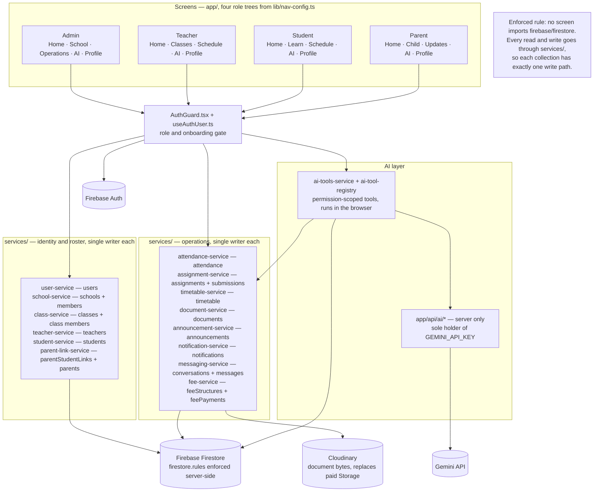

## Tech stack

Next.js 14 (App Router) · TypeScript · Tailwind CSS · Framer Motion · Firebase (Auth + Firestore, free tier only) · Cloudinary (document bytes) · Gemini API (optional, server-side only) · lucide-react
